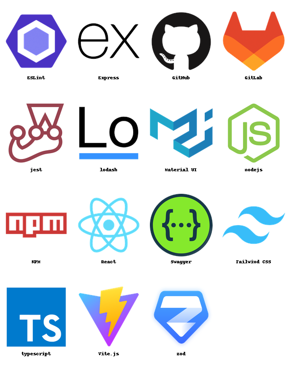
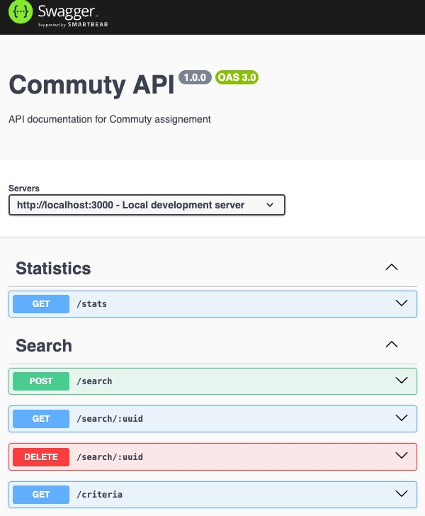
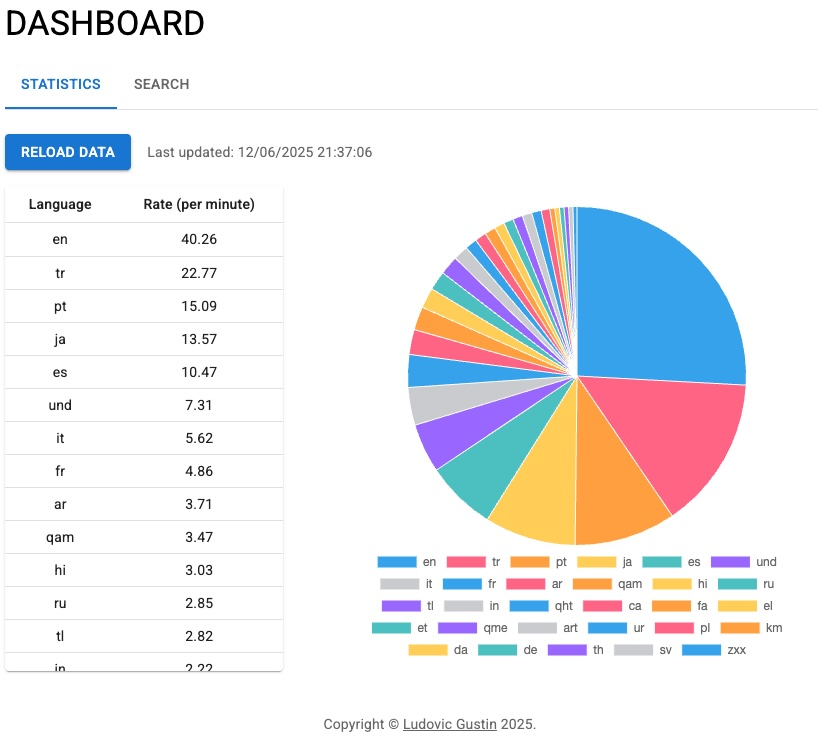

# Commuty assignement : "Twitter/X consumer" 

Monorepo for Commuty Next Full Stack assignement project (using npm workspaces), with a Swagger API page.

Base stack: **Typescript** + **Node.js** + **Express** + **React.js**



# Installation
## Prereq: Node 22.16.0+
  
```bash
$ node -v 
v22.16.0
```
  
If necessary, install a version manager such as `nvm`:
  - Follow installation https://github.com/nvm-sh/nvm
  - `nvm use` to automatically install and use the version specified in `.nvmrc` 

## Install dependencies

- `npm install` will automatically populate root, frontend and backend `node_modules`

# Execution

## backend
No database are required; server will automatically run on port 3000.

- `npm run backend` from root 
- `open http://localhost:3000/api-docs` will expose directly a swagger interface to test each endpoints




## frontend

- `npm run frontend` from root
- `open http://localhost:5173`
- Navigate accross the stats or search tabs to play with the requested features ;-)


